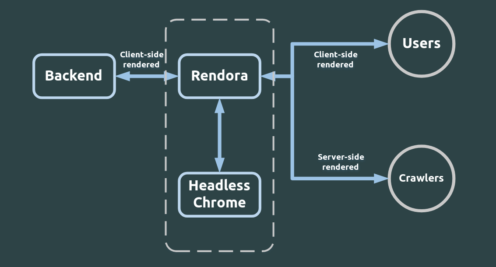

# Rendora

<p align="center">

</p>

[](http://goreportcard.com/report/rendora/rendora)
[](https://circleci.com/gh/rendora/rendora/tree/master)
[](https://godoc.org/github.com/rendora/rendora)
[](https://github.com/rendora/rendora/blob/master/LICENSE)
[](https://discord.gg/6yyErk8)

Rendora is a dynamic renderer to provide zero-configuration server-side rendering mainly to web crawlers in order to effortlessly improve SEO for websites developed in modern Javascript frameworks such as React.js, Vue.js, Angular.js, etc... Rendora works totally independently of your frontend and backend stacks

<p align="center">

</p>

## Main Features

- Zero change needed in frontend and backend code
- Filters based on user agents and paths
- Single fast binary written in Golang
- Multiple Caching strategies
- Support for asynchronous pages
- Prometheus metrics
- Choose your configuration system (YAML, TOML or JSON)
- Container ready

## What is Rendora?

Rendora can be seen as a reverse HTTP proxy server sitting between your backend server (e.g. Node.js/Express.js, Python/Django, etc...)
and potentially your frontend proxy server (e.g. nginx, traefik, apache, etc...) or even directly to the outside world that does actually nothing but transporting requests and responses as they are **except** when it detects whitelisted requests according to the config. In that case, Rendora instructs a headless Chrome instance to request and render the corresponding page and then return the server-side rendered page back to the client (i.e. the frontend proxy server or the outside world). This simple functionality makes Rendora a powerful dynamic renderer
without actually changing anything in both frontend and backend code.

## What is Dynamic Rendering?

Dynamic rendering means that the server provides server-side rendered HTML to web crawlers such as GoogleBot and BingBot and at the same time provides the typical initial HTML to normal users in order to be rendered at the client side. Dynamic rendering is meant to improve SEO for websites written in modern javascript frameworks like React, Vue, Angular, etc...

**Read more about dynamic rendering from these articles by
[Google](https://developers.google.com/search/docs/guides/dynamic-rendering) and
[Bing](https://blogs.bing.com/webmaster/october-2018/bingbot-Series-JavaScript,-Dynamic-Rendering,-and-Cloaking-Oh-My). Also you might want to watch this interesting talk at
[Google I/O 2018](https://youtu.be/PFwUbgvpdaQ)**

## How does Rendora work?

Rendora is listening by default to the port `3001` but can be changed using the config file; for every request coming from the frontend server or the outside world, there are some checks or filters that are tested against the headers and/or paths according to Rendora's configuration file to determine whether Rendora should just pass the initial HTML returned from the backend server or use headless Chrome to provide a server-side rendered HTML. To be more specific, for every request there are 2 paths:

1. If the request is whitelisted as a candidate for SSR (i.e. a GET request that passes all user agent and path filters), Rendora instructs the headless Chrome instance to request the corresponding page, render it and return the response which contains the final server-side rendered HTML. You usually want to whitelist only web crawlers like GoogleBot, BingBot, etc...

2. If the request isn't whitelisted (i.e. the request is not a GET request or doesn't pass any of the filters), Rendora will simply act as a transparent reverse HTTP proxy and just conveys requests and responses as they are. You usually want to blacklist real users in order to return the usual client-side rendered HTML coming from the backend server back to them.

## Install and run Rendora

### First, run a headless Chrome instance

If Chrome/Chromium is installed in your system, you can run it using

```bash
google-chrome --headless --remote-debugging-port=9222
```

_note:_ Mac users may have a `google-chrome: command not found` error. If that's the case, run the following command and repeat the previous step:

```bash
alias google-chrome="/Applications/Google\ Chrome.app/Contents/MacOS/Google\ Chrome"
```

or simply using docker

```bash
docker run --tmpfs /tmp --net=host rendora/chrome-headless
```

_note:_ the `tmpfs` flag is optional but it's recommended for performance reasons since `rendora/chrome-headless` runs with flag `--user-data-dir=/tmp`

### Then, run Rendora

you can build and run Rendora from source code, (**NOTE**: please read the [configuration manual](docs/configuration/) before running Rendora)

```bash
git clone https://github.com/rendora/rendora
cd rendora
# MAKE SURE YOU HAVE GO V1.11+ INSTALLED
make build
sudo make install
rendora --config CONFIG_FILE.yaml
```

or simply using docker

```bash
docker run --net=host -v ./CONFIG_FILE.yaml:/etc/rendora/config.yaml rendora/rendora
```

## Documentation

You can read the docs [here](https://rendora.co/docs/) or [here](docs)

## Configuration

Configuration is discussed in detail in docs [here](https://rendora.co/docs/configuration/) or [here](docs/configuration)

### A minimal config file example

```yaml
target:
  url: 'http://127.0.0.1' # this is the base url addressed by the headless Chrome instance, it can be simply your website url
backend:
  url: 'http://127.0.0.1:8000' # your backend server url

filters:
  userAgent: # .i.e. only whitelist useragents containing the keywords "bot", "slurp", "bing" or "crawler"
    defaultPolicy: blacklist
    exceptions:
      keywords:
        - bot
        - slurp
        - bing
        - crawler
```

### A more customized config file

```yaml
listen:
  address: 0.0.0.0
  port: 3001
cache:
  type: redis
  timeout: 6000
  redis:
    address: localhost:6379
target:
  url: 'http://127.0.0.1'
backend:
  url: 'http://127.0.0.1:8000'
headless:
  internal:
    url: http://localhost:9222
output:
  minify: true
filters:
  userAgent:
    defaultPolicy: blacklist
    exceptions:
      keywords:
        - bot
        - slurp
        - bing
        - crawler
  paths:
    defaultPolicy: whitelist
    exceptions:
      prefix:
        - /users/
```

## FAQs

### What is the difference between Rendora and Puppeteer?

[Puppeteer](https://github.com/GoogleChrome/puppeteer) is a great Node.js library which provides a generic high-level API to control headless Chrome. On the other hand, Rendora is a dynamic renderer that acts as a reverse HTTP proxy placed in front of your backend server to provide server-side rendering mainly to web crawlers in order to effortlessly improve SEO.

### What is the difference between Rendora and Rendertron?

[Rendertron](https://github.com/GoogleChrome/rendertron) is comparable to Rendora in the sense that they both aim to provide SSR using headless Chrome; however there are various differences that can make Rendora a much better choice:

1. **Architecture**: Rendertron is a HTTP server that returns SSR'ed HTML back to the client. That means that your server must contain the necessary code to filter requests and asks rendertron to provide the SSR'ed HTML and then return it back to the original client. Rendora does all that automatically by acting as a reverse HTTP proxy in front of your backend.

2) **Caching**: Rendora can be configured to use internal local store or Redis to cache SSR'ed HTML.
3) **Performance**: In addition to caching, Rendora is able to skip fetching and rendering unnecessary content CSS, fonts, images, etc... which can substantially reduce the intial DOM load latency.
4) **Development**: Rendertron is developed in Node.js while Rendora is a single binary written in Golang.
5) **API and Metrics**: Rendora provides Prometheus metrics about SSR latencies and number of SSR'ed and total requests. Furthermore, Rendora provides a JSON rendering endpoint that contains body, status and headers of the SSR response by the headless Chrome instance.

## Acknowledgements

Many thanks to [@mafredri](https://github.com/mafredri) for his effort to create [cdp](https://github.com/mafredri/cdp), a great Chrome DevTools Protocols client in Golang.

Follow rendora news and releases on [Twitter](https://twitter.com/_rendora)

George Badawi - 2018
